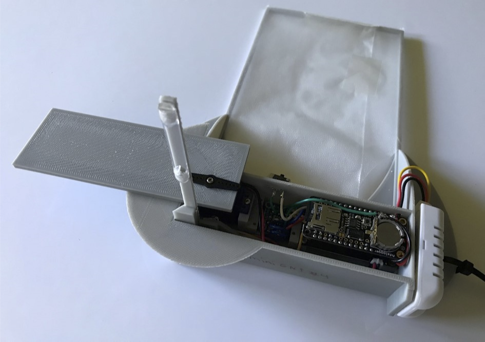
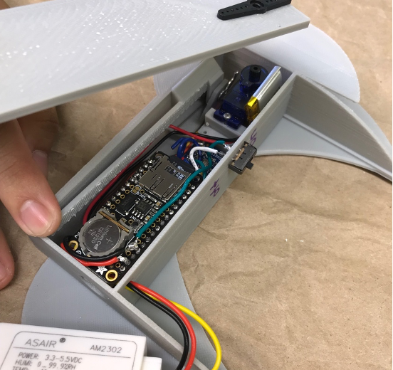

## [An updated version of the miniGNI can be found here](https://github.com/klackerman00/miniGNI_plus)
# miniGNI Version 1.0



## **mini-GNI** - Miniature Giant Nucleus Impactor 

The mini-GNI is a small, 3D instrumentation created by the [Nugent Research Group](http://alisonnugent.com/) used to sample sea salt aerosol (SSA) aloft using ground-based platforms. Modeled off the [National Center for Atmospheric Research GNI](https://www.eol.ucar.edu/instruments/giant-nuclei-impactor), the mini-GNI combines Arduino based microcontrollers and 3D printed technology in order to expose polycarbonate slides to free airstreams, allowing SSA to impact onto them. Then, these slides are analyzed in by NCAR's GNI microscope to calculate aerosol particle size distributions. Information on the methods behind the miniGNI can be found in this paper: 

> A New Instrument for Determining the Coarse-Mode Sea Salt Aerosol Size Distribution - [Taing et al., 2021](https://journals.ametsoc.org/view/journals/atot/38/11/JTECH-D-20-0197.1.xml)

while the microscope methods are explained in this paper: 

> The Giant Nucleus Impactor (GNI)—A System for the Impaction and Automated Optical Sizing of Giant Aerosol Particles with Emphasis on Sea Salt. Part I: Basic Instrument and Algorithms - [Jensen et al., 2020](https://journals.ametsoc.org/view/journals/atot/37/9/jtechD190109.xml?rskey=7VVZ45&result=6)

Additional information about the observations gathered by the miniGNI V1.0 are in this corresponding paper: 

> Mechanisms controlling giant sea salt aerosol size distributions along a tropical orographic coastline - [Ackerman et al., 2023](https://acp.copernicus.org/articles/23/13735/2023/)


### Mini-GNI Repository 

The mini-GNI repository is composed of several folders containing different python processing scripts.

To download this repository from GitHub, run:

```
  git clone https://github.com/nugentlab/miniGNI
```

To just download them individual parts and refer to the context in which the scripts are used, please refer to the appropriate subsection. 

## 1. Construct your own Mini-GNI

This directory provides the information necessary to create your own mini-GNI. It's contents are filled with all of the STL files necessary for 3-D printing, in addition to the coding for the arduino microcontroller within the mini-GNI and the arduino within the base controller (the controller used to connect with the mini-GNI while it is aloft). An assembly diagram is provided as well. 

To download this directory from GitHub, run:

```
  git clone https://github.com/nugentlab/miniGNI/miniGNI_Assembly
```

## 2. Mini-GNI Sample Anaylsis Preperation

Once the mini-GNI has been used to sample (more specific details on sampling methodology here *insert link to paper*), code needs to be run to compile environment files for use in analysis by the microscope. The miniGNI_functions.py creates functions used by the environment_file_generator.py that compile the information obtained by the miniGNI sensors along with measurements that were obtained by the acting scientist (i.e. wind speeds). These environment files are generated for each sample obtained, and rely on the manual input of wind speed.

To download only this directory from GitHub, run:

```
  git clone https://github.com/nugentlab/miniGNI/miniGNI_Analysis_Code
```

## 3. Mini-GNI Post-Processing  

Now that the slides have been analysed by the NCAR microscope, their data comes back as dry salt radii in bins of 0.2 microns. These can be processed efficiently using the codes below and compiled into a CSV file to be read by Python's Pandas package. Additinoally, extra code for downloading wave information from local buoys is also included. 

To download only this directory from GitHub, run:

```
  git clone https://github.com/nugentlab/miniGNI/SSA_Analysis 
```

## 4. SSA Anaylsis Scripts for Easy Variable Comparison

The final scripts include all of the functions used in analyzing the CSV files that contained all relevant information to the SSA sizes, concentratrions and distributions. These scripts contain straight forward plots that allow for interchangable variables for the x, y, and z axes. 

To download only this directory from GitHub, run:

```
  git clone https://github.com/nugentlab/miniGNI/SSA_Plot_Codes
```


#### Ranz-Wong Code Reference

This folder contains original code and information used to calculate the collision efficiency developed by Ranz and Wong in 1952. 
